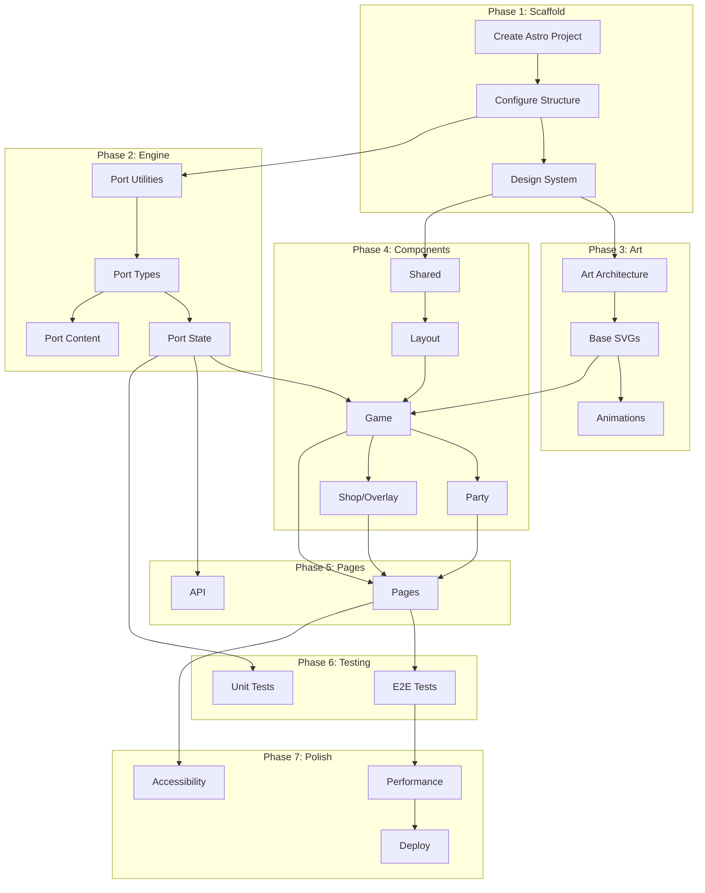

# Orchestrator Prompt: Long Hall Astro Refactor

## Mission

Create a new Astro-based implementation of The Long Hall roguelike game in a separate folder (`long-hall-next/`), running parallel to the existing implementation until production-ready swap.

---

## Context

### Current State
- **Location**: `mnehmos.long-hall.game/` (existing Vite + TypeScript app)
- **Documentation**: 
  - [ARCHITECTURE-ANALYSIS.md](./ARCHITECTURE-ANALYSIS.md) - Current patterns
  - [WISH-LIST-ASTRO.md](./WISH-LIST-ASTRO.md) - Target architecture
  - [WISH-WAS-DIFFERENT.md](./WISH-WAS-DIFFERENT.md) - Lessons learned
  - [TDD-PLAN.md](./TDD-PLAN.md) - Testing strategy

### Target State
- **Location**: `mnehmos.long-hall.game/long-hall-next/` (new Astro app)
- **Stack**: Astro + Preact (islands) + Tailwind + Vitest
- **Art**: SVG-based (replacing ASCII)
- **Style**: Aligned with Mnehmos copper theme

---

## Task Map

### Phase 1: Scaffold (Architect → Code)

#### Task 1.1: Create Astro Project
**Mode**: Code
**Workspace**: `mnehmos.long-hall.game/long-hall-next/`
**File Patterns**: `*`

**Objective**: Initialize new Astro project with required integrations.

```bash
# Commands to execute
cd mnehmos.long-hall.game
npm create astro@latest long-hall-next -- --template minimal --typescript strict
cd long-hall-next
npx astro add preact tailwind
npm install @preact/signals gsap zod vitest @testing-library/preact happy-dom
```

**Acceptance Criteria**:
- [ ] Astro project created
- [ ] Preact integration working
- [ ] Tailwind configured
- [ ] TypeScript strict mode
- [ ] Vitest configured
- [ ] Project runs with `npm run dev`

---

#### Task 1.2: Configure Project Structure
**Mode**: Code
**Workspace**: `mnehmos.long-hall.game/long-hall-next/`
**File Patterns**: `src/**`, `*.config.*`, `tsconfig.json`

**Objective**: Set up folder structure matching target architecture.

**Create Structure**:
```
long-hall-next/
├── src/
│   ├── components/
│   │   ├── layout/
│   │   ├── game/
│   │   ├── party/
│   │   ├── equipment/
│   │   ├── shop/
│   │   ├── overlays/
│   │   └── shared/
│   ├── islands/           # Interactive Preact
│   ├── engine/            # Port from existing
│   ├── content/           # YAML content files
│   ├── config/            # Balance constants
│   ├── art/               # SVG art system
│   ├── styles/
│   │   ├── tokens.css
│   │   └── global.css
│   ├── lib/               # Utilities
│   └── pages/
│       ├── index.astro
│       ├── play.astro
│       ├── leaderboard.astro
│       └── about.astro
├── tests/
│   ├── unit/
│   ├── integration/
│   └── e2e/
├── public/
│   └── sounds/            # Future audio
├── astro.config.mjs
├── tailwind.config.mjs
├── tsconfig.json
├── vitest.config.ts
└── package.json
```

**Acceptance Criteria**:
- [ ] All directories created
- [ ] Path aliases configured in tsconfig (`@/` → `src/`)
- [ ] Tailwind config with copper theme tokens
- [ ] Vitest config with happy-dom

---

#### Task 1.3: Design System Setup
**Mode**: Code
**Workspace**: `mnehmos.long-hall.game/long-hall-next/`
**File Patterns**: `src/styles/**`, `tailwind.config.mjs`

**Objective**: Create CSS design tokens aligned with Mnehmos brand.

**Files to Create**:

`src/styles/tokens.css`:
- Color palette (copper accent)
- Rarity colors
- Class colors
- Spacing scale
- Typography scale
- Shadows and borders

`tailwind.config.mjs`:
- Extend colors with tokens
- Add custom animations
- Configure dark mode

**Reference**: See `Mnehmos/src/styles/global.css` for copper palette.

**Acceptance Criteria**:
- [ ] `--copper` and `--copper-light` defined
- [ ] Rarity colors (common → godly)
- [ ] Class colors (fighter, wizard, rogue, cleric, ranger)
- [ ] Tailwind extended with custom colors
- [ ] Global styles imported

---

### Phase 2: Engine Port (Code)

#### Task 2.1: Port Core Utilities
**Mode**: Code
**Workspace**: `mnehmos.long-hall.game/long-hall-next/`
**File Patterns**: `src/lib/**`, `src/engine/**`

**Objective**: Port core utilities from existing codebase.

**Source Files** (from `../src/core/`):
- `dice.ts` → `src/lib/dice.ts`
- `rng.ts` → `src/lib/rng.ts`
- `hash.ts` → `src/lib/hash.ts`

**Requirements**:
- Add JSDoc comments
- Export from `src/lib/index.ts`
- Keep seeded RNG interface identical

**Acceptance Criteria**:
- [ ] All core utilities ported
- [ ] Same API as original
- [ ] Unit tests passing

---

#### Task 2.2: Port Type Definitions
**Mode**: Code
**Workspace**: `mnehmos.long-hall.game/long-hall-next/`
**File Patterns**: `src/engine/types.ts`

**Objective**: Port and improve type definitions.

**Source**: `../src/engine/types.ts`
**Target**: `src/engine/types.ts`

**Improvements**:
- Add Zod schemas for runtime validation
- Improve documentation
- Add discriminated unions where appropriate

**Acceptance Criteria**:
- [ ] All types ported
- [ ] Zod schemas for major types
- [ ] Types exported cleanly

---

#### Task 2.3: Port State Management
**Mode**: Code  
**Workspace**: `mnehmos.long-hall.game/long-hall-next/`
**File Patterns**: `src/engine/**`, `src/state/**`

**Objective**: Port reducer and state logic.

**Source Files**:
- `../src/engine/reducer.ts`
- `../src/engine/state.ts`
- `../src/engine/combat.ts`
- `../src/engine/combatHelpers.ts`
- `../src/engine/rest.ts`
- `../src/engine/loot.ts`
- `../src/engine/generateRoom.ts`
- `../src/engine/resolveRoom.ts`
- `../src/engine/score.ts`

**Requirements**:
- Wrap with Preact signals for reactivity
- Keep reducer pure
- Add integration tests

**Acceptance Criteria**:
- [ ] All engine files ported
- [ ] Signal-based state wrapper
- [ ] Tests for reducer actions
- [ ] Deterministic with seeded RNG

---

#### Task 2.4: Port Content to YAML
**Mode**: Code
**Workspace**: `mnehmos.long-hall.game/long-hall-next/`
**File Patterns**: `src/content/**`

**Objective**: Convert TypeScript content tables to YAML with schemas.

**Source Files** (from `../src/content/`):
- `tables.ts` → `content/items/*.yaml`, `content/enemies/*.yaml`, etc.
- `abilities.ts` → `content/abilities/*.yaml`
- `classes.ts` → `content/classes/*.yaml`
- `themes.ts` → `content/themes/*.yaml`

**Structure**:
```
src/content/
├── items/
│   ├── weapons.yaml
│   ├── armor.yaml
│   └── accessories.yaml
├── enemies/
│   ├── basic.yaml
│   ├── elite.yaml
│   └── bosses.yaml
├── abilities/
│   └── all.yaml
├── classes/
│   └── all.yaml
└── schemas/
    ├── item.ts      # Zod schema
    ├── enemy.ts
    └── ability.ts
```

**Requirements**:
- Zod schema validation at build time
- Type generation from schemas
- Astro content collections

**Acceptance Criteria**:
- [ ] All content migrated to YAML
- [ ] Schemas validate content
- [ ] Content loads at build time
- [ ] Type-safe access from code

---

### Phase 3: SVG Art System (Architect → Code)

#### Task 3.1: Design SVG Art Architecture
**Mode**: Architect
**Output**: `src/art/README.md`

**Objective**: Design the SVG art system architecture.

**Requirements**:
- Character art with equipment slots
- Animation states (idle, attack, hurt, death)
- Color theming per class
- Equipment changes appearance
- Responsive sizing

**Deliverable**: Architecture document with:
- SVG structure conventions
- Animation approach
- Color variable system
- Component interface

---

#### Task 3.2: Create Base Character SVGs
**Mode**: Code
**Workspace**: `mnehmos.long-hall.game/long-hall-next/`
**File Patterns**: `src/art/**`

**Objective**: Create SVG art for all character classes.

**Characters Needed**:
- Fighter (sword/shield)
- Wizard (staff/robes)
- Rogue (daggers/hood)
- Cleric (mace/holy symbol)
- Ranger (bow/cloak)

**Files**:
```
src/art/
├── heroes/
│   ├── fighter.svg
│   ├── wizard.svg
│   ├── rogue.svg
│   ├── cleric.svg
│   └── ranger.svg
├── enemies/
│   ├── goblin.svg
│   ├── skeleton.svg
│   ├── orc.svg
│   └── troll.svg
└── components/
    ├── CharacterArt.astro
    └── AnimatedCharacter.tsx  # Preact for animations
```

**Acceptance Criteria**:
- [ ] All hero classes have SVG art
- [ ] Basic enemies have SVG art
- [ ] Idle animation CSS
- [ ] Class color theming works

---

#### Task 3.3: Implement Animation System
**Mode**: Code
**Workspace**: `mnehmos.long-hall.game/long-hall-next/`
**File Patterns**: `src/art/**`, `src/lib/animations.ts`

**Objective**: Create animation utilities for combat.

**Animations Needed**:
- Attack (lunge + weapon swing)
- Hit (flash + recoil)
- Miss (whiff effect)
- Damage numbers (float up + fade)
- Death (fade out)
- Heal (green glow)
- Level up (sparkle burst)

**Technology**: GSAP or Web Animations API

**Acceptance Criteria**:
- [ ] Attack animation implemented
- [ ] Damage numbers working
- [ ] Death animation
- [ ] Performance acceptable (60fps)

---

### Phase 4: Components (Code)

#### Task 4.1: Shared Components
**Mode**: Code
**Workspace**: `mnehmos.long-hall.game/long-hall-next/`
**File Patterns**: `src/components/shared/**`

**Objective**: Create reusable component library.

**Components**:
- `Button.astro` - Standard button with variants
- `StatBar.astro` - HP/XP progress bars
- `Tooltip.tsx` - Hover information (Preact island)
- `Modal.tsx` - Popup container (Preact island)
- `Icon.astro` - SVG icon wrapper

**Acceptance Criteria**:
- [ ] All shared components created
- [ ] Props documented
- [ ] Basic styling with Tailwind
- [ ] Accessible (ARIA)

---

#### Task 4.2: Layout Components
**Mode**: Code
**Workspace**: `mnehmos.long-hall.game/long-hall-next/`
**File Patterns**: `src/components/layout/**`, `src/layouts/**`

**Objective**: Create page layouts.

**Components**:
- `GameLayout.astro` - Main game layout
- `Header.astro` - Title, stats, auth
- `Sidebar.astro` - Party status (shell)
- `MainContent.astro` - Room area (shell)
- `CombatLog.astro` - History panel (shell)

**Acceptance Criteria**:
- [ ] Responsive grid layout
- [ ] Mobile-first design
- [ ] Sticky sidebars
- [ ] Container queries where needed

---

#### Task 4.3: Game Components
**Mode**: Code
**Workspace**: `mnehmos.long-hall.game/long-hall-next/`
**File Patterns**: `src/components/game/**`, `src/islands/**`

**Objective**: Create interactive game components.

**Static Components** (Astro):
- `RoomDisplay.astro` - Room visualization
- `ActionButtons.astro` - Action button layout

**Interactive Islands** (Preact):
- `GameEngine.tsx` - Main game loop + state
- `CombatPanel.tsx` - Attack buttons + targeting
- `CombatLogLive.tsx` - Live updating log

**Acceptance Criteria**:
- [ ] Game renders correctly
- [ ] Combat actions work
- [ ] State persists across interactions
- [ ] Performance acceptable

---

#### Task 4.4: Party & Equipment Components
**Mode**: Code
**Workspace**: `mnehmos.long-hall.game/long-hall-next/`
**File Patterns**: `src/components/party/**`, `src/components/equipment/**`

**Objective**: Create party and equipment UI.

**Components**:
- `PartyMember.astro` - Sidebar party card
- `HeroPanel.astro` - Full hero display
- `SkillsGrid.astro` - Skill points display
- `PaperDoll.astro` - Equipment layout
- `EquipmentSlot.astro` - Individual slot
- `ItemCard.astro` - Item display
- `InventoryPanel.tsx` - Interactive inventory (island)

**Acceptance Criteria**:
- [ ] Party members display correctly
- [ ] Equipment shows on paper doll
- [ ] Skills grid with stat allocation
- [ ] Item tooltips working

---

#### Task 4.5: Shop & Overlay Components
**Mode**: Code
**Workspace**: `mnehmos.long-hall.game/long-hall-next/`
**File Patterns**: `src/components/shop/**`, `src/components/overlays/**`

**Objective**: Create shop and overlay UI.

**Components**:
- `ShopSection.astro` - Item shop
- `RecruitSection.astro` - Hire companions
- `GameOver.astro` - Death screen
- `Victory.astro` - Room cleared
- `ShrineBlessing.astro` - Blessing popup
- `Leaderboard.tsx` - Score table (island)

**Acceptance Criteria**:
- [ ] Shop displays items correctly
- [ ] Buy/hire interactions work
- [ ] Overlays appear/dismiss properly
- [ ] Leaderboard loads data

---

### Phase 5: Pages & Integration (Code)

#### Task 5.1: Create Pages
**Mode**: Code
**Workspace**: `mnehmos.long-hall.game/long-hall-next/`
**File Patterns**: `src/pages/**`

**Objective**: Create all page routes.

**Pages**:
- `index.astro` - Landing/menu
- `play.astro` - Main game
- `leaderboard.astro` - Full leaderboard
- `about.astro` - Game information

**Acceptance Criteria**:
- [ ] All pages render
- [ ] Navigation works
- [ ] SEO meta tags
- [ ] Responsive

---

#### Task 5.2: API Integration
**Mode**: Code
**Workspace**: `mnehmos.long-hall.game/long-hall-next/`
**File Patterns**: `src/lib/api.ts`, `src/pages/api/**`

**Objective**: Port API client and add server endpoints.

**Requirements**:
- Port `../src/api/client.ts`
- Add Astro API routes if needed
- Clerk authentication

**Acceptance Criteria**:
- [ ] Leaderboard API works
- [ ] Score submission works
- [ ] Auth integration

---

### Phase 6: Testing (Red → Green → Blue)

#### Task 6.1: Unit Tests
**Mode**: Red-Phase → Green-Phase
**Workspace**: `mnehmos.long-hall.game/long-hall-next/`
**File Patterns**: `tests/unit/**`, `src/**`

**Objective**: Achieve 90%+ coverage on engine.

**Priority Tests**:
1. Dice rolling
2. Combat resolution
3. XP/leveling
4. Reducer actions
5. Room generation

**Acceptance Criteria**:
- [ ] All tests in TDD-PLAN.md implemented
- [ ] 90%+ coverage on engine
- [ ] CI passes

---

#### Task 6.2: E2E Tests
**Mode**: Code
**Workspace**: `mnehmos.long-hall.game/long-hall-next/`
**File Patterns**: `tests/e2e/**`, `playwright.config.ts`

**Objective**: Critical path E2E coverage.

**Scenarios**:
1. Start new game
2. Complete combat
3. Shop interaction
4. Game over flow
5. Leaderboard

**Acceptance Criteria**:
- [ ] All critical paths tested
- [ ] Tests run in CI
- [ ] Screenshot on failure

---

### Phase 7: Polish & Deploy

#### Task 7.1: Accessibility Audit
**Mode**: Code
**Workspace**: `mnehmos.long-hall.game/long-hall-next/`
**File Patterns**: `src/**`

**Objective**: WCAG AA compliance.

**Requirements**:
- ARIA labels on interactive elements
- Keyboard navigation
- Screen reader testing
- Color contrast

**Acceptance Criteria**:
- [ ] Lighthouse accessibility 90+
- [ ] Keyboard-only playable
- [ ] No critical ARIA issues

---

#### Task 7.2: Performance Optimization
**Mode**: Code
**Workspace**: `mnehmos.long-hall.game/long-hall-next/`
**File Patterns**: `src/**`, `astro.config.mjs`

**Objective**: Fast initial load and smooth gameplay.

**Targets**:
- First Contentful Paint < 1.5s
- Time to Interactive < 3s
- 60fps during combat

**Acceptance Criteria**:
- [ ] Lighthouse performance 90+
- [ ] Bundle size reasonable
- [ ] No jank during animations

---

#### Task 7.3: Production Deploy Setup
**Mode**: Code
**Workspace**: `mnehmos.long-hall.game/long-hall-next/`
**File Patterns**: `*.config.*`, `Dockerfile`, `.github/**`

**Objective**: Production deployment configuration.

**Requirements**:
- Vercel or Railway config
- Environment variables
- CI/CD pipeline
- Preview deployments

**Acceptance Criteria**:
- [ ] Deploys to preview URL
- [ ] Production deploy works
- [ ] Env vars configured
- [ ] CI/CD running

---

## Dependencies



---

## Parallel Opportunities

These tasks can run in parallel:

| Parallel Group | Tasks |
|----------------|-------|
| A | T2.4 (Content) ∥ T3.1 (Art Architecture) |
| B | T3.2 (SVGs) ∥ T4.1 (Shared Components) |
| C | T4.4 (Party) ∥ T4.5 (Shop/Overlay) |
| D | T6.1 (Unit) ∥ T7.1 (A11y) |

---

## Success Criteria

### Minimum Viable Parity
- [ ] Can start new game
- [ ] Combat works end-to-end
- [ ] Equipment system functional
- [ ] Shop and rest work
- [ ] Game over/restart works
- [ ] Leaderboard displays

### Enhancement Goals
- [ ] SVG art for all characters
- [ ] Combat animations
- [ ] Save/load (localStorage)
- [ ] Mobile fully playable
- [ ] Lighthouse all 90+

---

## Rollback Plan

If critical issues arise:
1. Keep existing `mnehmos.long-hall.game/` running
2. New app at `/next` path for testing
3. DNS switch only after full validation
4. Keep old codebase for 30 days post-swap

---

## Notes for Orchestrator

- **Use TDD**: Always write tests first (Red-Phase) before implementation (Green-Phase)
- **Incremental**: Each task should result in working state
- **Signal-based**: Use Preact signals for reactive state
- **Content-first**: Port content to YAML early for validation
- **Art iterative**: Start with simple SVGs, enhance later
- **Test seeds**: Use deterministic seeds for testing
