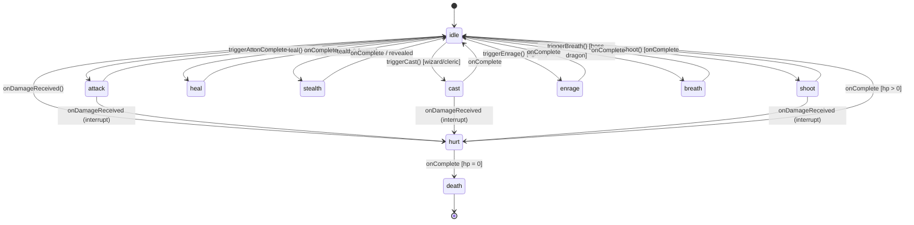

# Animation State Machine Specification

> **Document ID**: `ANIM-STATES-001`  
> **Version**: `1.0.0`  
> **Created**: 2026-01-05  
> **Phase**: Phase 3 - SVG Art System  
> **Task**: S3.1.2  
> **Dependency**: [SVG-SPEC.md](./SVG-SPEC.md) (S3.1.1)

## Overview

This specification defines the animation state machine for all character sprites in The Long Hall combat system. It establishes the valid states, transitions, timing constraints, event hooks, and implementation responsibilities (CSS vs GSAP).

The state machine ensures smooth, responsive combat animations while maintaining strict performance requirements—particularly the **<300ms attack animation** constraint for snappy combat feel.

---

## 1. State Machine Diagram

### 1.1 Core State Diagram (ASCII)

```
                              ┌─────────────────────────────────────┐
                              │                                     │
                              ▼                                     │
        ┌──────────────────────────────────────────┐                │
        │                                          │                │
        │                  IDLE                    │◄───────────────┤
        │           (default, looping)             │                │
        │                                          │                │
        └──────────────────────────────────────────┘                │
                 │            │           │                         │
                 │            │           │                         │
      ┌──────────┘            │           └──────────┐              │
      │ attack                │ hurt                 │ special      │
      │ triggered             │ received             │ triggered    │
      ▼                       ▼                      ▼              │
┌───────────┐          ┌───────────┐          ┌───────────────┐     │
│  ATTACK   │          │   HURT    │          │   SPECIAL     │     │
│  <300ms   │──────────│   200ms   │──────────│   varies      │─────┤
│           │ complete │           │ complete │ (cast/heal/   │     │
└───────────┘          └───────────┘          │  stealth/etc) │     │
      │                       │               └───────────────┘     │
      │                       │                                     │
      │ onComplete            │ HP > 0                              │
      │                       │                                     │
      │                       ▼                                     │
      │                ┌─────────────┐                              │
      │                │   HP = 0?   │──────────────────────────────┘
      │                └─────────────┘            no
      │                       │
      │                       │ yes
      │                       ▼
      │                ┌───────────┐
      │                │  DEATH    │
      │                │   600ms   │
      │                │ (terminal)│
      └───────────────►└───────────┘
           damage point
           triggers check
```

### 1.2 State Machine (Mermaid Format)



---

## 2. State Definitions

### 2.1 Core States (Required)

| State | ID | Duration | Loop | Description |
|-------|-----|----------|------|-------------|
| **Idle** | `#state-idle` | ∞ (loop) | Yes | Default resting pose with subtle breathing/floating animation |
| **Attack** | `#state-attack` | **≤ 280ms** | No | Offensive action pose (swing, thrust, strike) |
| **Hurt** | `#state-hurt` | 200ms | No | Damage reaction (recoil, flash) |
| **Death** | `#state-death` | 600ms | No | Defeat animation (fall, fade) - **terminal state** |

### 2.2 Special States (Class-Specific)

| State | ID | Duration | Roles | Description |
|-------|-----|----------|-------|-------------|
| **Cast** | `#state-cast` | 350ms | wizard, cleric | Spellcasting pose with arcane/divine effects |
| **Heal** | `#state-heal` | 400ms | cleric | Divine healing channel with golden glow |
| **Stealth** | `#state-stealth` | 250ms | rogue | Fade to shadow, reduced opacity |
| **Shoot** | `#state-shoot` | 250ms | ranger | Bow draw and release |
| **Enrage** | `#state-enrage` | 300ms | fighter | Battle rage activation with red aura |
| **Breath** | `#state-breath` | 500ms | boss (dragon) | Breath weapon charge and release |

### 2.3 Optional States (Future)

| State | ID | Duration | Description |
|-------|-----|----------|-------------|
| **Defend** | `#state-defend` | 200ms | Shield block / dodge pose |
| **Victory** | `#state-victory` | 800ms | Celebration pose (combat end) |
| **Stunned** | `#state-stunned` | ∞ (status) | Dazed/paralyzed state |

---

## 3. Transition Rules

### 3.1 Valid Transitions Matrix

| From \ To | idle | attack | hurt | death | cast | heal | stealth | shoot | enrage | breath |
|-----------|------|--------|------|-------|------|------|---------|-------|--------|--------|
| **idle** | - | ✅ | ✅ | ❌ | ✅ | ✅ | ✅ | ✅ | ✅ | ✅ |
| **attack** | ✅ | ❌ | ✅ | ✅ | ❌ | ❌ | ❌ | ❌ | ❌ | ❌ |
| **hurt** | ✅ | ❌ | ❌ | ✅ | ❌ | ❌ | ❌ | ❌ | ❌ | ❌ |
| **death** | ❌ | ❌ | ❌ | - | ❌ | ❌ | ❌ | ❌ | ❌ | ❌ |
| **cast** | ✅ | ❌ | ✅ | ✅ | ❌ | ❌ | ❌ | ❌ | ❌ | ❌ |
| **heal** | ✅ | ❌ | ❌ | ❌ | ❌ | ❌ | ❌ | ❌ | ❌ | ❌ |
| **stealth** | ✅ | ✅ | ✅ | ✅ | ❌ | ❌ | ❌ | ❌ | ❌ | ❌ |
| **shoot** | ✅ | ❌ | ✅ | ✅ | ❌ | ❌ | ❌ | ❌ | ❌ | ❌ |
| **enrage** | ✅ | ❌ | ❌ | ❌ | ❌ | ❌ | ❌ | ❌ | ❌ | ❌ |
| **breath** | ✅ | ❌ | ✅ | ✅ | ❌ | ❌ | ❌ | ❌ | ❌ | ❌ |

### 3.2 Transition Triggers

```typescript
// Transition trigger types
type TransitionTrigger = 
  | 'action_start'      // Player initiates action (attack, cast, etc.)
  | 'damage_received'   // Character takes damage
  | 'hp_zero'           // HP reaches 0
  | 'animation_complete'// Current animation finished
  | 'status_applied'    // Status effect begins (stealth, enrage)
  | 'status_removed'    // Status effect ends
  | 'interrupt';        // Forced state change (damage interrupts cast)
```

### 3.3 Transition Sequence Examples

**Example 1: Basic Attack Flow**
```
idle → attack (action_start)
     → [onDamagePoint fires at 180ms]
     → idle (animation_complete @ 280ms)
```

**Example 2: Taking Damage During Attack**
```
idle → attack (action_start)
     → hurt (damage_received @ 150ms, interrupts)
     → idle (animation_complete @ 350ms)
```

**Example 3: Lethal Damage**
```
idle → hurt (damage_received)
     → death (hp_zero detected @ completion)
     → [terminal - no further transitions]
```

---

## 4. Timing Specifications

### 4.1 Animation Timeline Breakdown

#### Attack Animation (≤ 280ms budget)

```
Time (ms)   0     50    100   150   180   200   250   280
            │     │     │     │     │     │     │     │
Phase       ├─ Anticipation ─┼─ Strike ─┼─ Recovery ─┤
            │                │          │            │
Events      │ onStart        │ onDamage │            │ onComplete
            │                │ Point    │            │
Easing      │ ease-out       │ linear   │ ease-in    │
```

| Phase | Duration | Purpose |
|-------|----------|---------|
| Anticipation | 0–100ms | Wind-up, weapon raise |
| Strike | 100–200ms | Main action, damage point at ~180ms |
| Recovery | 200–280ms | Return to neutral pose |

**Critical Constraint**: `onDamagePoint()` MUST fire before 200ms to ensure responsive damage feedback.

#### Hurt Animation (200ms)

```
Time (ms)   0     50    100   150   200
            │     │     │     │     │
Phase       ├─ Recoil ──┼─ Flash ──┤
            │           │          │
Events      │ onStart   │          │ onComplete
            │ + flash   │          │ [check HP]
```

#### Death Animation (600ms)

```
Time (ms)   0     100   200   300   400   500   600
            │     │     │     │     │     │     │
Phase       ├─ Collapse ─────┼─ Fall ──┼─ Fade ──┤
            │                │         │         │
Events      │ onStart        │         │         │ onDeathComplete
            │                │         │ opacity │ [cleanup]
            │                │         │ to 0.5  │
```

### 4.2 Timing Token References

Timings should use CSS variables from [`tokens.css`](../src/styles/tokens.css:84-87):

| Animation | Token | Value | Notes |
|-----------|-------|-------|-------|
| Attack | `--anim-attack` | `280ms` | New token (add to tokens.css) |
| Hurt | `--anim-hurt` | `200ms` | Maps to `--transition-normal` |
| Death | `--anim-death` | `600ms` | New token (add to tokens.css) |
| Idle breathing | `--anim-idle-loop` | `3000ms` | New token, CSS keyframes |
| Cast | `--anim-cast` | `350ms` | New token |
| Heal | `--anim-heal` | `400ms` | New token |

### 4.3 New Token Definitions (Add to tokens.css)

```css
/* === ANIMATION TIMING TOKENS === */
:root {
  /* Core combat animations */
  --anim-attack: 280ms;
  --anim-hurt: 200ms;
  --anim-death: 600ms;
  
  /* Idle loop timing */
  --anim-idle-loop: 3000ms;
  --anim-idle-float: 2000ms;
  
  /* Special ability animations */
  --anim-cast: 350ms;
  --anim-heal: 400ms;
  --anim-stealth: 250ms;
  --anim-shoot: 250ms;
  --anim-enrage: 300ms;
  --anim-breath: 500ms;
  
  /* Easing functions */
  --ease-attack: cubic-bezier(0.25, 0.1, 0.25, 1);
  --ease-hurt: cubic-bezier(0.68, -0.55, 0.265, 1.55); /* overshoot recoil */
  --ease-death: cubic-bezier(0.4, 0, 0.2, 1);
}
```

---

## 5. Event Hook Interface

### 5.1 TypeScript Interface Definition

```typescript
// File: src/engine/animation/types.ts

/**
 * Animation states corresponding to SVG group IDs
 */
export type AnimationState = 
  | 'idle'
  | 'attack'
  | 'hurt'
  | 'death'
  | 'cast'
  | 'heal'
  | 'stealth'
  | 'shoot'
  | 'enrage'
  | 'breath';

/**
 * Context provided with animation events
 */
export interface AnimationEventContext {
  /** The entity being animated (Actor or Enemy ID) */
  entityId: string;
  
  /** Entity type for lookup */
  entityType: 'hero' | 'enemy';
  
  /** Current animation state */
  state: AnimationState;
  
  /** Previous state (for transition tracking) */
  previousState: AnimationState | null;
  
  /** Timestamp when animation started */
  startTime: number;
  
  /** Expected duration in ms */
  duration: number;
  
  /** Whether animation was interrupted */
  interrupted: boolean;
}

/**
 * Damage event context (extends animation context)
 */
export interface DamagePointContext extends AnimationEventContext {
  /** Target entity ID */
  targetId: string;
  
  /** Calculated damage (pre-application) */
  damage: number;
  
  /** Whether this is a critical hit */
  isCritical: boolean;
  
  /** Damage type for visual effects */
  damageType: 'physical' | 'magical' | 'fire' | 'ice' | 'holy' | 'shadow';
}

/**
 * Animation controller event hooks
 */
export interface AnimationEventHooks {
  /**
   * Fired when an animation begins
   * Use for: starting sound effects, updating UI state
   */
  onAnimationStart: (ctx: AnimationEventContext) => void;
  
  /**
   * Fired when an animation completes (not interrupted)
   * Use for: state machine transitions, action resolution
   */
  onAnimationComplete: (ctx: AnimationEventContext) => void;
  
  /**
   * Fired at the exact moment damage should be applied
   * Occurs during attack animation at ~180ms mark
   * Use for: damage calculation, HP update, combat log
   */
  onDamagePoint: (ctx: DamagePointContext) => void;
  
  /**
   * Fired when death animation completes
   * Use for: entity cleanup, loot drop, XP award
   */
  onDeathComplete: (ctx: AnimationEventContext) => void;
  
  /**
   * Fired when animation is interrupted by another event
   * Use for: cleanup of interrupted effects, state reconciliation
   */
  onAnimationInterrupt: (ctx: AnimationEventContext, interruptReason: InterruptReason) => void;
}

/**
 * Reasons an animation can be interrupted
 */
export type InterruptReason = 
  | 'damage_received'
  | 'status_applied'
  | 'forced_transition'
  | 'entity_destroyed';

/**
 * Animation controller public API
 */
export interface AnimationController {
  /** Current state of the animation */
  readonly currentState: AnimationState;
  
  /** Whether an animation is currently playing */
  readonly isAnimating: boolean;
  
  /** Trigger a state transition */
  transition(toState: AnimationState, options?: TransitionOptions): Promise<void>;
  
  /** Force immediate transition (skips current animation) */
  forceTransition(toState: AnimationState): void;
  
  /** Register event hooks */
  setHooks(hooks: Partial<AnimationEventHooks>): void;
  
  /** Get timeline for current animation (GSAP) */
  getTimeline(): gsap.core.Timeline | null;
  
  /** Pause current animation */
  pause(): void;
  
  /** Resume paused animation */
  resume(): void;
  
  /** Reset to idle state */
  reset(): void;
}

/**
 * Options for state transitions
 */
export interface TransitionOptions {
  /** Override default duration */
  duration?: number;
  
  /** Custom easing function */
  ease?: string;
  
  /** Delay before starting transition */
  delay?: number;
  
  /** Additional context for event hooks */
  context?: Record<string, unknown>;
}
```

### 5.2 Event Flow Diagram

```
┌─────────────────────────────────────────────────────────────────┐
│                    ATTACK ACTION FLOW                          │
├─────────────────────────────────────────────────────────────────┤
│                                                                 │
│  Engine                    AnimationController         Game UI  │
│    │                              │                       │     │
│    │  transition('attack')        │                       │     │
│    │─────────────────────────────►│                       │     │
│    │                              │  onAnimationStart()   │     │
│    │                              │──────────────────────►│     │
│    │                              │                       │     │
│    │                              │     [play SFX]        │     │
│    │                              │                       │     │
│    │                  ┌───────────┤                       │     │
│    │                  │ @ 180ms   │                       │     │
│    │                  ▼           │                       │     │
│    │  onDamagePoint() │           │                       │     │
│    │◄─────────────────┘           │                       │     │
│    │                              │                       │     │
│    │  [apply damage]              │                       │     │
│    │  [update HP]                 │                       │     │
│    │                              │                       │     │
│    │                  ┌───────────┤                       │     │
│    │                  │ @ 280ms   │                       │     │
│    │                  ▼           │                       │     │
│    │  onAnimationComplete()       │                       │     │
│    │◄─────────────────────────────│                       │     │
│    │                              │  [update UI state]    │     │
│    │                              │──────────────────────►│     │
│    │                              │                       │     │
│    │  [check for death]           │                       │     │
│    │  [next turn logic]           │                       │     │
│    │                              │                       │     │
└─────────────────────────────────────────────────────────────────┘
```

---

## 6. Interruptibility Matrix

### 6.1 State Interruptibility Rules

| State | Can Be Interrupted? | Interrupted By | Notes |
|-------|---------------------|----------------|-------|
| **idle** | N/A (waiting) | Any trigger | Always available for transition |
| **attack** | ⚠️ Partial | `damage_received` | Damage point still fires if past 180ms |
| **hurt** | ❌ No | Nothing | Must complete to check HP |
| **death** | ❌ No | Nothing | Terminal state, cannot interrupt |
| **cast** | ✅ Yes | `damage_received` | Spell fails if interrupted before completion |
| **heal** | ❌ No | Nothing | Protected healing channel |
| **stealth** | ✅ Yes | `damage_received`, `action_start` | Attacking breaks stealth |
| **shoot** | ⚠️ Partial | `damage_received` | Arrow fires if past 150ms mark |
| **enrage** | ❌ No | Nothing | Buff always completes |
| **breath** | ⚠️ Partial | `damage_received` | Breath continues if past 300ms |

### 6.2 Interrupt Priority Levels

```typescript
/**
 * Priority determines which events can interrupt which animations
 * Higher priority always wins
 */
export enum InterruptPriority {
  NONE = 0,           // Cannot interrupt (death, hurt)
  LOW = 1,            // Can be interrupted by most things (idle)
  MEDIUM = 2,         // Can only be interrupted by damage (attack, cast)
  HIGH = 3,           // Can only be interrupted by death (enrage)
  ABSOLUTE = 4,       // Cannot be interrupted (death animation itself)
}

export const STATE_PRIORITY: Record<AnimationState, InterruptPriority> = {
  idle: InterruptPriority.LOW,
  attack: InterruptPriority.MEDIUM,
  hurt: InterruptPriority.ABSOLUTE,
  death: InterruptPriority.ABSOLUTE,
  cast: InterruptPriority.MEDIUM,
  heal: InterruptPriority.HIGH,
  stealth: InterruptPriority.LOW,
  shoot: InterruptPriority.MEDIUM,
  enrage: InterruptPriority.HIGH,
  breath: InterruptPriority.MEDIUM,
};
```

### 6.3 Interrupt Behavior

When an animation is interrupted:

1. `onAnimationInterrupt()` fires with context and reason
2. Any pending `onDamagePoint()` is cancelled (unless past threshold)
3. Current GSAP timeline is killed
4. New state animation begins immediately
5. `onAnimationComplete()` does NOT fire for interrupted animation

---

## 7. CSS vs GSAP Responsibility Split

### 7.1 Responsibility Overview

| Aspect | CSS | GSAP | Rationale |
|--------|-----|------|-----------|
| **Idle breathing** | ✅ | ❌ | Infinite loop, no JS overhead |
| **Idle floating** | ✅ | ❌ | Continuous subtle motion |
| **Attack timeline** | ❌ | ✅ | Precise timing, damage point callback |
| **Hurt flash/recoil** | ❌ | ✅ | Needs JS hook for HP check |
| **Death fall/fade** | ❌ | ✅ | Cleanup callback required |
| **State visibility** | ✅ | ❌ | `.active` class toggle |
| **Effect particles** | ❌ | ✅ | Dynamic generation |
| **Glow pulses** | ✅ | ❌ | Status indicator, continuous |

### 7.2 CSS Animations (Continuous/Looping)

```css
/* File: src/styles/animations.css */

/* === IDLE ANIMATIONS (CSS) === */

/* Subtle breathing motion for living characters */
@keyframes idle-breathe {
  0%, 100% { transform: scaleY(1); }
  50% { transform: scaleY(1.02); }
}

.anim-state.active#state-idle .layer-body {
  animation: idle-breathe var(--anim-idle-loop) ease-in-out infinite;
}

/* Floating motion for magic users/ghosts */
@keyframes idle-float {
  0%, 100% { transform: translateY(0); }
  50% { transform: translateY(-3px); }
}

.character--wizard .anim-state.active#state-idle,
.character--cleric .anim-state.active#state-idle,
.enemy--ghost .anim-state.active#state-idle {
  animation: idle-float var(--anim-idle-float) ease-in-out infinite;
}

/* Status effect glow pulse */
@keyframes status-glow {
  0%, 100% { filter: drop-shadow(0 0 3px var(--status-color)); }
  50% { filter: drop-shadow(0 0 8px var(--status-color)); }
}

.has-status .layer-effects {
  animation: status-glow 1.5s ease-in-out infinite;
}

/* === STATE VISIBILITY (CSS) === */

.anim-state {
  opacity: 0;
  visibility: hidden;
  pointer-events: none;
}

.anim-state.active {
  opacity: 1;
  visibility: visible;
  pointer-events: auto;
}
```

### 7.3 GSAP Animations (One-Shot/Callback-Dependent)

```typescript
// File: src/engine/animation/timelines.ts

import { gsap } from 'gsap';
import type { AnimationState, DamagePointContext } from './types';

/**
 * Create attack animation timeline
 * MUST complete in ≤280ms
 */
export function createAttackTimeline(
  svg: SVGElement,
  onDamagePoint: (ctx: DamagePointContext) => void,
  onComplete: () => void
): gsap.core.Timeline {
  const tl = gsap.timeline({
    onComplete,
    defaults: { ease: 'var(--ease-attack)' }
  });
  
  const idleState = svg.querySelector('#state-idle');
  const attackState = svg.querySelector('#state-attack');
  const weapon = attackState?.querySelector('#weapon-sword, #weapon-staff, #weapon-bow');
  const effectArc = attackState?.querySelector('.attack-arc');
  
  tl
    // Swap state visibility (instant)
    .set(idleState, { opacity: 0, visibility: 'hidden' })
    .set(attackState, { opacity: 1, visibility: 'visible' })
    
    // Anticipation phase (0-100ms)
    .to(weapon, {
      rotation: -15,
      duration: 0.1,
      ease: 'power2.out'
    })
    
    // Strike phase (100-180ms)
    .to(weapon, {
      rotation: 30,
      duration: 0.08,
      ease: 'power3.in'
    })
    
    // Damage point callback at 180ms
    .call(() => {
      onDamagePoint({} as DamagePointContext); // Context filled by caller
    }, [], 0.18)
    
    // Effect arc flash
    .fromTo(effectArc, 
      { opacity: 0, scale: 0.5 },
      { opacity: 0.8, scale: 1, duration: 0.05 },
      0.15
    )
    .to(effectArc, {
      opacity: 0,
      duration: 0.05
    })
    
    // Recovery phase (180-280ms)
    .to(weapon, {
      rotation: 0,
      duration: 0.1,
      ease: 'power2.out'
    })
    
    // Swap back to idle (at 280ms)
    .set(attackState, { opacity: 0, visibility: 'hidden' }, 0.28)
    .set(idleState, { opacity: 1, visibility: 'visible' }, 0.28);
  
  return tl;
}

/**
 * Create hurt animation timeline
 * Duration: 200ms
 */
export function createHurtTimeline(
  svg: SVGElement,
  onComplete: () => void
): gsap.core.Timeline {
  const tl = gsap.timeline({ onComplete });
  
  const idleState = svg.querySelector('#state-idle');
  const hurtState = svg.querySelector('#state-hurt');
  const damageFlash = hurtState?.querySelector('.damage-flash');
  
  tl
    // Swap to hurt state
    .set(idleState, { opacity: 0, visibility: 'hidden' })
    .set(hurtState, { opacity: 1, visibility: 'visible' })
    
    // Red flash overlay
    .fromTo(damageFlash,
      { opacity: 0 },
      { opacity: 0.5, duration: 0.05 }
    )
    .to(damageFlash, {
      opacity: 0,
      duration: 0.15
    })
    
    // Recoil shake
    .to(hurtState, {
      x: -5,
      duration: 0.03,
      ease: 'power2.out'
    }, 0)
    .to(hurtState, {
      x: 5,
      duration: 0.03,
      ease: 'none'
    })
    .to(hurtState, {
      x: 0,
      duration: 0.1,
      ease: 'elastic.out(1, 0.5)'
    })
    
    // Swap back to idle
    .set(hurtState, { opacity: 0, visibility: 'hidden' }, 0.2)
    .set(idleState, { opacity: 1, visibility: 'visible' }, 0.2);
  
  return tl;
}

/**
 * Create death animation timeline
 * Duration: 600ms (terminal state)
 */
export function createDeathTimeline(
  svg: SVGElement,
  onDeathComplete: () => void
): gsap.core.Timeline {
  const tl = gsap.timeline({ onComplete: onDeathComplete });
  
  const currentState = svg.querySelector('.anim-state.active');
  const deathState = svg.querySelector('#state-death');
  
  tl
    // Swap to death state
    .set(currentState, { opacity: 0, visibility: 'hidden' })
    .set(deathState, { opacity: 1, visibility: 'visible' })
    
    // Fall animation
    .to(deathState, {
      y: 20,
      rotation: -10,
      duration: 0.3,
      ease: 'power2.in'
    })
    
    // Settle
    .to(deathState, {
      rotation: -5,
      duration: 0.15,
      ease: 'bounce.out'
    })
    
    // Fade out
    .to(deathState, {
      opacity: 0.5,
      duration: 0.15,
      ease: 'power2.out'
    });
  
  return tl;
}
```

### 7.4 Implementation Checklist

| Component | Technology | Status |
|-----------|------------|--------|
| Idle breathing keyframes | CSS | To implement |
| Idle float keyframes | CSS | To implement |
| State visibility toggle | CSS | ✅ Defined in SVG-SPEC |
| Attack timeline | GSAP | To implement |
| Hurt timeline | GSAP | To implement |
| Death timeline | GSAP | To implement |
| Damage point hook | GSAP callback | To implement |
| Cast timeline | GSAP | To implement |
| Heal timeline | GSAP | To implement |

---

## 8. Class-Specific Animation States

### 8.1 Fighter

| State | Trigger | Duration | Visual |
|-------|---------|----------|--------|
| `attack` | Basic attack | 280ms | Sword swing arc |
| `enrage` | Action Surge ability | 300ms | Red aura pulse, eyes glow |

**Enrage Effect**: Applies `enraged` status, increases damage for X turns.

### 8.2 Wizard

| State | Trigger | Duration | Visual |
|-------|---------|----------|--------|
| `attack` | Staff strike | 280ms | Staff thrust |
| `cast` | Any spell | 350ms | Arcane circles, purple glow |

**Cast Effect**: Hands raised, arcane symbols orbit, spell fires at 300ms mark.

### 8.3 Rogue

| State | Trigger | Duration | Visual |
|-------|---------|----------|--------|
| `attack` | Dagger strike | 250ms | Fast double-strike |
| `stealth` | Hide ability | 250ms | Fade to 50% opacity, shadow aura |

**Stealth Effect**: Character semi-transparent until next attack or damage received.

### 8.4 Cleric

| State | Trigger | Duration | Visual |
|-------|---------|----------|--------|
| `attack` | Mace strike | 280ms | Mace overhead swing |
| `cast` | Offensive spell | 350ms | Divine light burst |
| `heal` | Healing spell | 400ms | Golden light channel, target glow |

**Heal Effect**: Hands together in prayer, golden particles flow to target.

### 8.5 Ranger

| State | Trigger | Duration | Visual |
|-------|---------|----------|--------|
| `attack` | Melee attack | 280ms | Dual blade slash |
| `shoot` | Ranged attack | 250ms | Bow draw and release |

**Shoot Effect**: Bow drawn at 100ms, arrow released at 150ms (damage point), follow-through to 250ms.

### 8.6 Boss-Specific (Dragon Example)

| State | Trigger | Duration | Visual |
|-------|---------|----------|--------|
| `attack` | Claw swipe | 350ms | Extended claw animation |
| `breath` | Breath weapon | 500ms | Inhale (200ms), exhale fire (300ms) |

**Breath Effect**: 
- 0-200ms: Chest expands, fire glow builds
- 200-500ms: Fire cone sprays, damage point at 300ms

---

## 9. Integration Examples

### 9.1 Combat Engine Integration

```typescript
// File: src/engine/combat.ts (integration example)

import { AnimationController } from './animation/types';

async function executeAttack(
  attacker: Actor,
  target: Enemy,
  attackerAnim: AnimationController,
  targetAnim: AnimationController
): Promise<CombatResult> {
  // Calculate damage before animation
  const damage = calculateDamage(attacker, target);
  const isCritical = checkCritical(attacker);
  
  // Set up damage point callback
  attackerAnim.setHooks({
    onDamagePoint: (ctx) => {
      // Apply damage at animation's 180ms mark
      target.hp -= damage;
      
      // Show damage number
      showDamageNumber(target, damage, isCritical);
      
      // Log to combat log
      logCombat(`${attacker.name} hits ${target.name} for ${damage} damage`);
    },
    onAnimationComplete: async () => {
      // Check if target died
      if (target.hp <= 0) {
        await targetAnim.transition('death');
      }
    }
  });
  
  // Start attack animation
  await attackerAnim.transition('attack');
  
  return { damage, isCritical, targetDied: target.hp <= 0 };
}
```

### 9.2 React/Astro Component Integration

```tsx
// File: src/components/game/AnimatedCharacter.tsx (conceptual)

import { useEffect, useRef } from 'react';
import { createAnimationController } from '@/engine/animation';
import type { AnimationController, AnimationState } from '@/engine/animation/types';

interface Props {
  svgContent: string;
  characterId: string;
  initialState?: AnimationState;
  onStateChange?: (state: AnimationState) => void;
}

export function AnimatedCharacter({ 
  svgContent, 
  characterId,
  initialState = 'idle',
  onStateChange 
}: Props) {
  const containerRef = useRef<HTMLDivElement>(null);
  const controllerRef = useRef<AnimationController | null>(null);
  
  useEffect(() => {
    if (!containerRef.current) return;
    
    // Parse SVG and create controller
    containerRef.current.innerHTML = svgContent;
    const svg = containerRef.current.querySelector('svg');
    
    if (svg) {
      controllerRef.current = createAnimationController(svg, {
        initialState,
        onStateChange
      });
    }
    
    return () => {
      controllerRef.current?.reset();
    };
  }, [svgContent, initialState, onStateChange]);
  
  // Expose controller via ref or context
  return (
    <div 
      ref={containerRef} 
      className="animated-character"
      data-character-id={characterId}
    />
  );
}
```

---

## 10. Validation & Testing

### 10.1 Animation Timing Tests

```typescript
// File: tests/unit/animation/timing.test.ts

describe('Animation Timing', () => {
  it('attack animation completes within 280ms budget', async () => {
    const start = performance.now();
    await animController.transition('attack');
    const elapsed = performance.now() - start;
    
    expect(elapsed).toBeLessThanOrEqual(300); // 20ms tolerance
  });
  
  it('damage point fires at approximately 180ms', async () => {
    let damagePointTime = 0;
    const start = performance.now();
    
    animController.setHooks({
      onDamagePoint: () => {
        damagePointTime = performance.now() - start;
      }
    });
    
    await animController.transition('attack');
    
    expect(damagePointTime).toBeGreaterThan(150);
    expect(damagePointTime).toBeLessThan(200);
  });
  
  it('hurt animation blocks death transition until complete', async () => {
    // Start hurt animation
    const hurtPromise = animController.transition('hurt');
    
    // Attempt immediate death transition
    await animController.transition('death');
    
    // Hurt should complete first
    await hurtPromise;
    expect(animController.currentState).toBe('death');
  });
});
```

### 10.2 State Machine Validation

```typescript
// File: tests/unit/animation/stateMachine.test.ts

describe('State Machine Transitions', () => {
  it('prevents invalid transitions', () => {
    animController.forceTransition('death');
    
    // Death is terminal - all transitions should be rejected
    expect(() => animController.transition('idle')).toThrow();
    expect(() => animController.transition('attack')).toThrow();
    expect(animController.currentState).toBe('death');
  });
  
  it('allows hurt to interrupt attack', async () => {
    // Start attack
    const attackPromise = animController.transition('attack');
    
    // Trigger hurt mid-attack
    await new Promise(r => setTimeout(r, 100));
    animController.forceTransition('hurt');
    
    // Should have transitioned to hurt
    expect(animController.currentState).toBe('hurt');
  });
});
```

---

## 11. Implementation Checklist

### 11.1 Files to Create

- [ ] `src/styles/animations.css` - CSS keyframes and state classes
- [ ] `src/engine/animation/types.ts` - TypeScript interfaces
- [ ] `src/engine/animation/timelines.ts` - GSAP timeline factories
- [ ] `src/engine/animation/controller.ts` - AnimationController implementation
- [ ] `src/engine/animation/index.ts` - Public exports
- [ ] `tests/unit/animation/timing.test.ts` - Timing validation tests
- [ ] `tests/unit/animation/stateMachine.test.ts` - State machine tests

### 11.2 Files to Update

- [ ] `src/styles/tokens.css` - Add animation timing tokens (Section 4.3)
- [ ] `src/engine/types.ts` - Import animation types
- [ ] `src/engine/combat.ts` - Integrate animation hooks

---

## 12. Related Documents

- [SVG-SPEC.md](./SVG-SPEC.md) - SVG structure and state group IDs (S3.1.1)
- [REFACTOR-TASK-MAP.md](./REFACTOR-TASK-MAP.md) - Phase 3 task breakdown
- [`tokens.css`](../src/styles/tokens.css) - Design token definitions
- [`types.ts`](../src/engine/types.ts) - Actor/Enemy type definitions

---

## Changelog

| Version | Date | Author | Changes |
|---------|------|--------|---------|
| 1.0.0 | 2026-01-05 | Architect | Initial specification |
